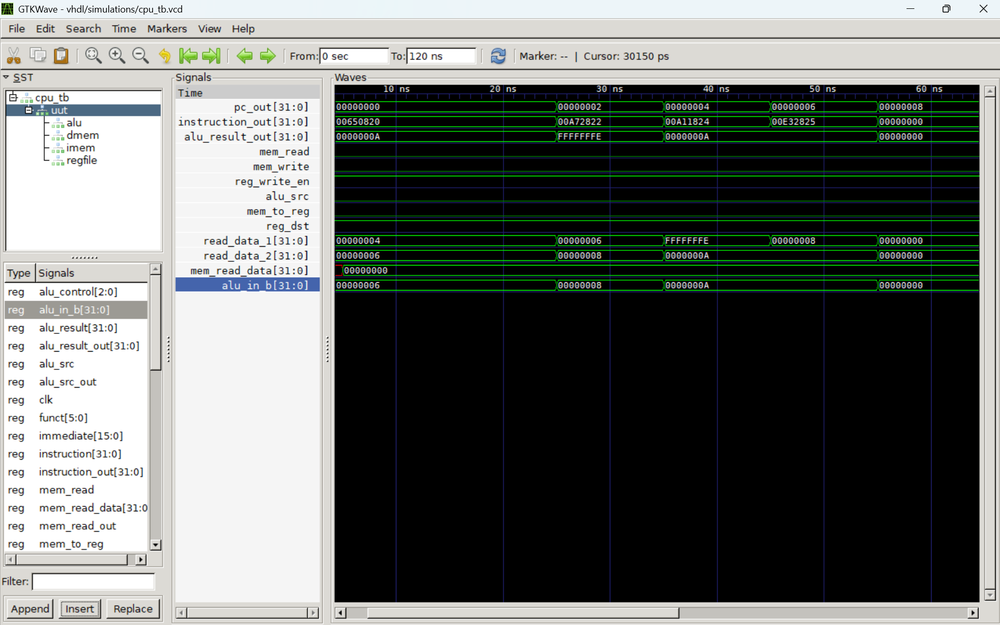
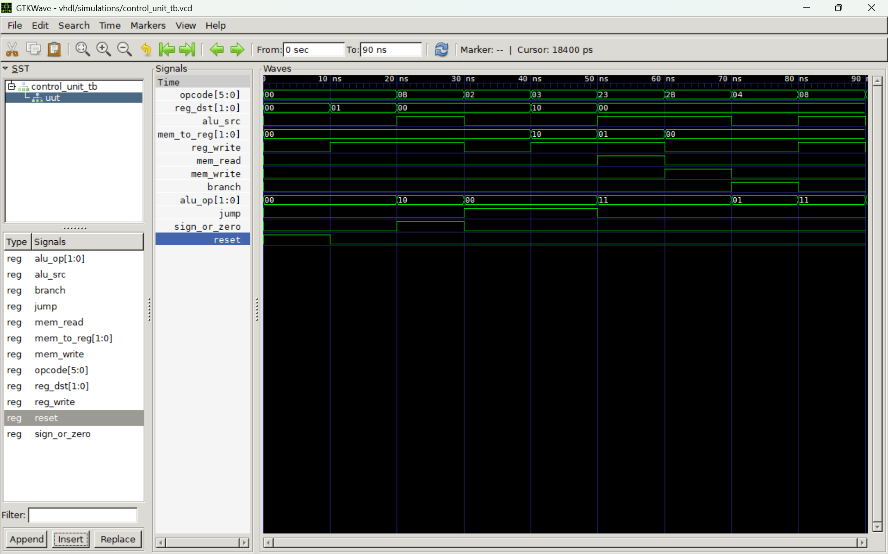
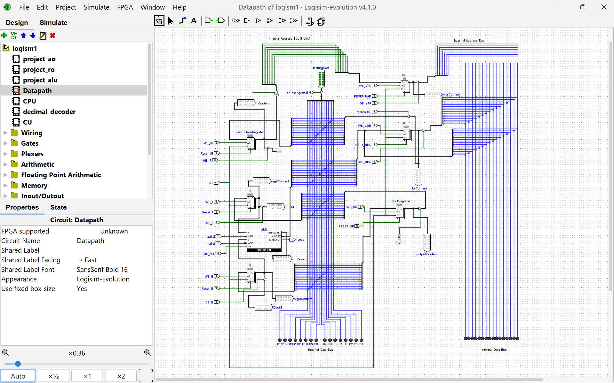

# cpu-design-logisim-vhdl

> 👨🏾‍💻 End-to-end CPU design project demonstrating both **logic-level architecture (Logisim)** and **hardware description modeling (VHDL)** — from datapath construction to full system simulation.

---

## 🚀 Overview

This project implements CPU design using **two complementary approaches**:

* 🧩 **Logisim Evolution (v4.1.0)** → visual design of a **16-bit CPU**
* ⚙️ **VHDL (GHDL + GTKWave)** → implementation of a **32-bit MIPS-style processor**

Together, they provide both:

* **Conceptual understanding (Logisim)**
* **Practical hardware modeling (VHDL)**

---

## 🧠 System Architecture

### 🔹 Logisim CPU (16-bit)

* ALU with multiple operations
* Register operations (read/write)
* Datapath wiring and control signals
* Instruction execution flow

### 🔹 VHDL CPU (32-bit MIPS-style)

* Modular design:

	* ALU
	* Control Unit
	* Register File
	* Instruction Memory
	* Data Memory
	* CPU Top Module
* Supports instruction execution including:

	* Arithmetic operations
	* Memory access (lw, sw)
	* Branching (beq)
	* Jump instructions (j, jal)

---

## 🖼️ Sample Outputs

### 🔹 CPU Waveform (VHDL Simulation)



### 🔹 Control Unit Waveform



### 🔹 Logisim Datapath



---

## 📂 Project Structure

```
logisim/
├── project/            # Logisim circuit files (.circ)
├── screenshots/        # Circuit design screenshots
└── report-ppt/         # Logisim report & presentation

vhdl/
├── src/                # VHDL source files
├── testbench/          # Testbenches
├── simulations/        # Simulation outputs (.vcd)
├── screenshots/        # GTKWave waveform screenshots
└── report-ppt/         # VHDL report & presentation
```

---

## 🧪 Simulations

Simulations were performed using:

* **GHDL** → compilation & execution
* **GTKWave** → waveform visualization

### Verified Behavior:

* ✅ Program Counter (PC) increments correctly
* ✅ Instruction flow changes over time
* ✅ ALU performs correct operations
* ✅ Registers read/write correctly
* ✅ Memory operations function properly
* ✅ Clock drives synchronous execution

---

## ▶️ How to Run

### 🔹 VHDL Simulation

```bash
# Analyze files
ghdl -a vhdl/src/*.vhd
ghdl -a vhdl/testbench/cpu_tb.vhd

# Elaborate testbench
ghdl -e cpu_tb

# Run simulation
ghdl -r cpu_tb --vcd=vhdl/simulations/cpu_tb.vcd
```

### 🔹 View Waveforms

```bash
gtkwave vhdl/simulations/cpu_tb.vcd
```

---

### 🔹 Logisim

1. Open `.circ` files in **Logisim Evolution**
2. Use the **clock tool** to simulate execution
3. Observe datapath and control signals

---

## ✅ Completed Tasks

### 🔹 Task 1 — Component Implementation

All CPU components implemented in VHDL with testbenches.

### 🔹 Task 2 — ALU Operations

Addition, subtraction, AND, OR, and comparison verified.

### 🔹 Task 3 — Register File

Registers successfully read and written.

### 🔹 Task 4 — Instruction Memory

MIPS instructions encoded and retrieved correctly.

### 🔹 Task 5 — Control Unit

Correct control signals generated for supported instructions.

---

## 🔗 CPU Integration

The full CPU simulation demonstrates:

* Program counter progression
* Instruction execution flow
* ALU computation pipeline
* Register file interaction
* Clock-driven synchronous behavior

---

## 🛠️ Tools Used

* Logisim Evolution v4.1.0
* VHDL
* GHDL
* GTKWave
* VS Code
* Git & GitHub

---

## 📄 Reports

### 📘 Logisim

* `logisim/report-ppt/Logisim_16bit_CPU_Report.pdf`

### 📘 VHDL

* `vhdl/report-ppt/VHDL_CPU_REPORT.pdf`

### 🎤 Presentations (Narrated)

* `logisim/report-ppt/16-Bit_CPU_Architecture0.pptx`
* `vhdl/report-ppt/32-bit_MIPS_VHDL_Design1.pptx`

---

## 🎯 Learning Outcomes

* CPU datapath design
* Hardware modeling in VHDL
* Testbench development
* Simulation and waveform debugging
* Understanding instruction execution at hardware level

---

## 💡 Key Insight

> Building the CPU in Logisim first provided an intuitive understanding of hardware interactions, while VHDL implementation reinforced precise control over timing, signals, and execution behavior.

---

## 👨‍💻 Author

**tetteh-etornam-emmanuel**
Computer Engineering Student
Interested in Systems, AI/ML, and Computer Architecture

---


